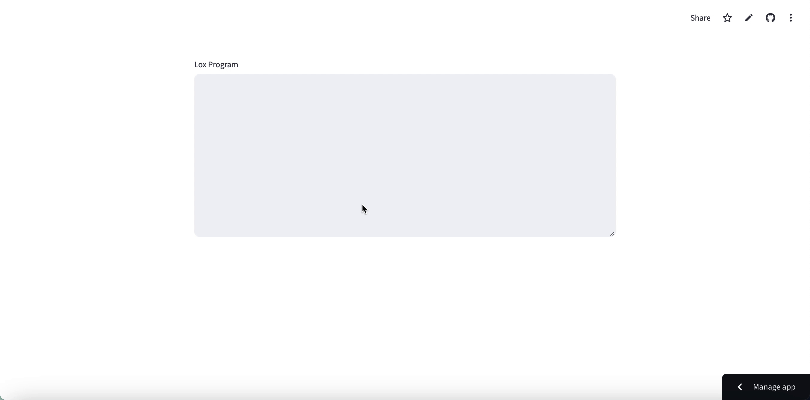

This is a python implementation of the Lox language as defined in the book Crafting Interpreters. My goal here was not to build something useful - Lox is a toy language - but to learn for the sake of learning and code for the sake of coding. So design decisions were often driven by fun or curiosity rather than maintainability.

https://lox-recursive-descent-parser.streamlit.app/



## Testing with codecrafters

To test locally, first activate an env where pipenv is installed:

```
conda activate py310
```

Run this command to parse and run the sample test case at `./tests/test_case.lox`:

```
make run
```

To run the whole codecrafters test suite run:

```
make test_all
```

See Makefile `test_all` command to see how to run individual substages.

***

Old notes on running tests for codecrafters site (no longer the intended path but could try to revert if I ever wanted to submit to the site again)

I initially used `codecrafters test` and eventually `codecrafters submit` (the latter checks off the stage on the website when passed) when working through their site. In practice, I started running `codecrafters submit 2>&1 | tee logs/{section_name}-{section_step_number}.txt` to also stash test logs for later in case I wanted to try to convert these to tests. (I later found a better way to do this, however.)

To test if a refactor broke functionality from previous rounds, run:
```
codecrafters test --previous
```
(This tests both previous rounds and the current round.)

**Note on dir names:** codecrafters originally had me place my code in a dir called `app` but I ended up changing this to `lox` since I wanted to use `app` to house a streamlit app. If I ever want to submit this code to the course again (or if it turns out this breaks tests), I imagine I will need to change that back. Mostly this would consist of changing imports but there are a couple gotchas: the commands in `your_program.sh` and my hack in `lox.utils.get_interpreter`.

### Local Testing

Codecrafters published all test cases in https://github.com/codecrafters-io/interpreter-tester so we can also run tests without a subscription. I pulled this repo and copied files into `tests`, pulling the Makefile into my project root and modifying it slightly. I can now run test cases like `make test_scanning_w_jlox`.

### Potential Improvements

I flagged some non-critical issues (things that don't cause the tests to fail but that would ideally get some followup attention if I was going to use this for anything other than learning purposes). Use this command to view them:

```rg couldfix lox```

## Codecrafters Instructions

[](https://app.codecrafters.io/users/codecrafters-bot?r=2qF)

This is a starting point for Python solutions to the
["Build your own Interpreter" Challenge](https://app.codecrafters.io/courses/interpreter/overview).

This challenge follows the book
[Crafting Interpreters](https://craftinginterpreters.com/) by Robert Nystrom.

In this challenge you'll build an interpreter for
[Lox](https://craftinginterpreters.com/the-lox-language.html), a simple
scripting language. Along the way, you'll learn about tokenization, ASTs,
tree-walk interpreters and more.

Before starting this challenge, make sure you've read the "Welcome" part of the
book that contains these chapters:

- [Introduction](https://craftinginterpreters.com/introduction.html) (chapter 1)
- [A Map of the Territory](https://craftinginterpreters.com/a-map-of-the-territory.html)
  (chapter 2)
- [The Lox Language](https://craftinginterpreters.com/the-lox-language.html)
  (chapter 3)

These chapters don't involve writing code, so they won't be covered in this
challenge. This challenge will start from chapter 4,
[Scanning](https://craftinginterpreters.com/scanning.html).

**Note**: If you're viewing this repo on GitHub, head over to
[codecrafters.io](https://codecrafters.io) to try the challenge.

# Passing the first stage

The entry point for your program is in `app/main.py`. Study and uncomment the
relevant code, and push your changes to pass the first stage:

```sh
git commit -am "pass 1st stage" # any msg
git push origin master
```

Time to move on to the next stage!

# Stage 2 & beyond

Note: This section is for stages 2 and beyond.

1. Ensure you have `python (3.12)` installed locally
2. Run `./your_program.sh` to run your program, which is implemented in
   `app/main.py`.
3. Commit your changes and run `git push origin master` to submit your solution
   to CodeCrafters. Test output will be streamed to your terminal.
